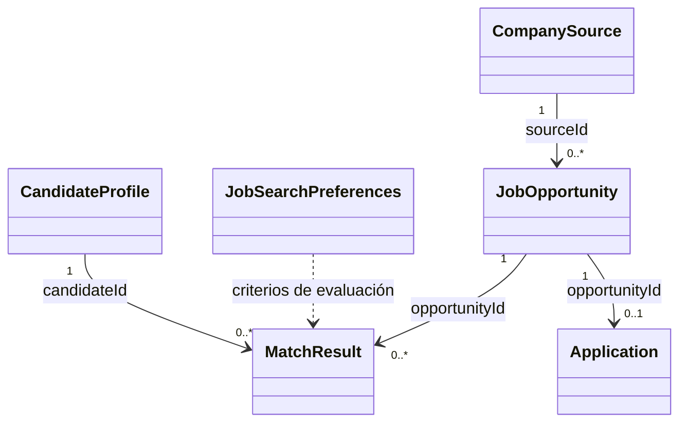

# Modelo de dominio

## Propósito

El modelo de dominio representa los conceptos principales del asistente de búsqueda laboral sin depender de React, persistencia ni servicios externos. Las clases almacenan datos del negocio; todavía no ejecutan automatizaciones ni reglas de evaluación.

## Clases y responsabilidades

### `CandidateProfile`

Representa información profesional no sensible y relativamente estable de una persona candidata: formación, habilidades, idiomas y referencia al CV. No contiene preferencias de búsqueda ni lógica de postulaciones.

### `JobSearchPreferences`

Representa criterios configurables para una búsqueda laboral, como roles objetivo, modalidades, tolerancias y preferencias de notificación. No contiene identidad del candidato ni valores hardcodeados para una persona específica.

Los rangos pueden expresarse con objetos `{ min, max }`. Por ejemplo, `travelTimeRangeHours` puede representar entre cuatro y cinco horas, y `weeklyOpportunityTarget` entre tres y cinco oportunidades. Los criterios no configurados permanecen en `null` o en colecciones vacías.

### `CompanySource`

Representa una fuente oficial de empleos de una empresa. Una fuente nueva comienza pendiente y debe pasar a estado aprobado antes de que una futura infraestructura pueda monitorearla.

### `JobOpportunity`

Representa una oferta detectada o ingresada manualmente. Conserva información como empresa, puesto, URL, publicación, requisitos y fuente de origen. Estos datos podrán colaborar con una futura detección de duplicados, pero esa comparación todavía no existe.

El atributo `salary` puede almacenar por separado `amount`, `currency`, `period` y `condition` cuando la publicación los informa. Todo dato salarial desconocido puede permanecer en `null`; no se realizan conversiones.

### `MatchResult`

Representa el resultado ya producido por una futura evaluación entre un perfil, sus preferencias y una oportunidad. Puede almacenar puntaje, recomendación, fortalezas, advertencias y habilidades faltantes. No calcula el puntaje ni decide una recomendación.

### `Application`

Representa una postulación efectivamente realizada. Referencia la oportunidad original y conserva el estado del proceso, las fechas de postulación y seguimiento, la próxima acción y las notas.

## Relaciones

- `CompanySource` puede originar varias oportunidades.
- `MatchResult` vincula un candidato con una oportunidad y considera sus preferencias vigentes.
- `Application` referencia la oportunidad que el usuario decidió convertir en una postulación real.

## Oportunidad y postulación

`JobOpportunity` existe desde que una oferta entra al sistema. Puede detectarse, guardarse, descartarse o archivarse sin que el usuario se haya postulado.

`Application` existe únicamente después de una postulación efectiva. Por eso `applied` no es un estado de oportunidad y `saved` no es un estado de postulación.

## Perfil y preferencias

`CandidateProfile` almacena hechos profesionales sobre la persona. `JobSearchPreferences` almacena decisiones configurables sobre la búsqueda. Separarlos permite cambiar prioridades, tolerancias o modalidades sin alterar la información profesional del candidato.

## Flujo conceptual

1. Se descubre una fuente oficial y se registra como pendiente.
2. El usuario aprueba la fuente antes de cualquier monitoreo.
3. Una oferta entra al sistema como `JobOpportunity` detectada.
4. Un servicio futuro compara la oportunidad con el perfil y las preferencias.
5. El resultado se almacena como `MatchResult`.
6. El usuario revisa la oportunidad y decide si desea postularse.
7. Solo después de una postulación efectiva se crea `Application`.
8. La aplicación registra el avance y los seguimientos del proceso.

## Datos sensibles excluidos

El modelo no almacena DNI, CUIL, pasaporte, domicilio exacto, contraseñas, credenciales de portales, datos bancarios, documentos personales, tokens ni API keys. `CandidateProfile` se limita a información profesional no sensible.

## Funcionalidades no implementadas

Todavía no existen:

- validaciones de campos obligatorios;
- reglas de transición entre estados;
- instancias con información de Luciano;
- persistencia remota o repositorios para otros agregados;
- monitoreo de fuentes;
- scraping o consumo de APIs;
- detección de duplicados;
- cálculo de puntajes o recomendaciones;
- pesos de compatibilidad;
- conversiones salariales;
- envío de notificaciones;
- autenticación;
- inteligencia artificial.

La interfaz React ya utiliza `JobOpportunity` para representar las oportunidades cargadas manualmente. La infraestructura local persiste estas oportunidades mediante `LocalStorageOpportunityRepository`, valida el formato almacenado y rehidrata instancias reales de la clase. El modelo de dominio continúa sin depender de React, `localStorage` ni del repositorio.

Los valores `null` representan información no disponible o aún no configurada; no constituyen una categoría de negocio adicional.
